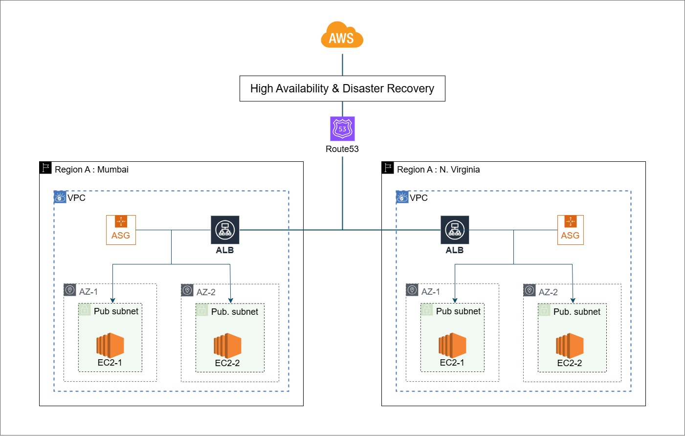

# 🌍 High Availability & Disaster Recovery on AWS

---

## 🚀 Overview

This project showcases a **multi-region HADR architecture** on AWS, designed for fault tolerance, scalability, and seamless disaster recovery.

- 🟢 **High Availability (HA):** Resilient across AZ failures
- 🔁 **Disaster Recovery (DR):** Region-level failover via Route 53
- 🧱 **Modular Infrastructure:** EC2, ASG, ALB, Route 53 across Mumbai & Virginia

---  

## 🧩 Architecture Components

| Layer         | Mumbai Region (Primary)  | Virginia Region (Secondary) |
| ------------- | ------------------------ | --------------------------- |
| VPC           | `vpc-hadr-mumbai`        | `vpc-hadr-virginia`         |
| Subnets       | AZ A & AZ B (public)     | AZ A & AZ B (public)        |
| EC2 + ASG     | 2 instances, auto-scaled | 2 instances, auto-scaled    |
| Load Balancer | ALB with health checks   | ALB with health checks      |
| DNS Failover  | Route 53 (primary alias) | Route 53 (secondary alias)  |

📌 **Failover Flow:**
1. Route 53 checks Mumbai ALB health
2. If unhealthy, traffic reroutes to Virginia ALB
3. ASGs maintain instance availability in both regions

---

## 🛠️ AWS Services Used

- **VPC** – Isolated networking per region
- **EC2** – Web server instances (Amazon Linux)
- **Auto Scaling** – Dynamic instance scaling
- **ALB** – Load balancing with health checks
- **Route 53** – DNS failover across regions
- **CloudWatch (optional)** – Monitoring & alerts
- **S3 (optional)** – Access logs & backups

---

## 📋 Deployment Summary

1. Provision VPCs and public subnets in both regions
2. Configure EC2 launch templates and ASGs
3. Deploy ALBs and target groups
4. Set up Route 53 with failover routing
5. Simulate DR by stopping Mumbai EC2s

---

## ✅ Benefits

- **Zero Downtime:** High availability across AZs and regions
- **Scalable:** ASGs adapt to traffic load
- **Resilient:** DNS failover ensures continuity
- **Modular:** Easy to replicate, automate, and extend

---

## 📁 Files

- `Setup-guide.md` – Step-by-step provisioning
- `README.md` – Project overview and architecture

---

> Designed for reliability. Built for scale. Ready for failure.